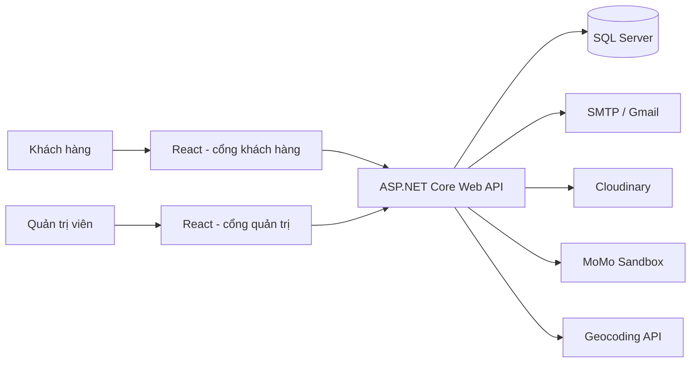

# ITHealthy

ITHealthy là hệ thống web đặt món ăn lành mạnh và quản lý chuỗi cửa hàng. Khách hàng có thể xem món, tự tạo bowl theo nhu cầu dinh dưỡng, đặt hàng và thanh toán. Nhân viên quản trị có thể quản lý sản phẩm, nguyên liệu, tồn kho, cửa hàng, đơn hàng, khuyến mãi, voucher và doanh thu.

Repository gồm ba ứng dụng dùng chung một cơ sở dữ liệu SQL Server:

- `ithealthy-fe`: website dành cho khách hàng.
- `admin-ithealthy-fe`: website quản trị.
- `ITHealthy_BE`: ASP.NET Core Web API xử lý nghiệp vụ và dữ liệu.

## Mục lục

- [Tính năng chính](#tính-năng-chính)
- [Kiến trúc và công nghệ](#kiến-trúc-và-công-nghệ)
- [Cấu trúc thư mục](#cấu-trúc-thư-mục)
- [Yêu cầu trước khi cài đặt](#yêu-cầu-trước-khi-cài-đặt)
- [Lưu ý về cơ sở dữ liệu](#lưu-ý-về-cơ-sở-dữ-liệu)
- [Cách 1: Chạy bằng Docker Compose](#cách-1-chạy-bằng-docker-compose)
- [Cách 2: Chạy thủ công để phát triển](#cách-2-chạy-thủ-công-để-phát-triển)
- [Cấu hình dịch vụ bên ngoài](#cấu-hình-dịch-vụ-bên-ngoài)
- [Tài khoản và phân quyền](#tài-khoản-và-phân-quyền)
- [Kiểm tra và build](#kiểm-tra-và-build)
- [Lỗi thường gặp](#lỗi-thường-gặp)

## Tính năng chính

### Dành cho khách hàng

- Đăng ký, xác thực email bằng OTP và đăng nhập.
- Xem sản phẩm theo danh mục và thông tin dinh dưỡng.
- Tự tạo bowl từ nhiều nguyên liệu; hệ thống tính giá, calories, protein, carbs và chất béo.
- Lưu bowl, chỉnh sửa bowl và thêm bowl vào giỏ hàng.
- Quản lý giỏ hàng và địa chỉ nhận hàng.
- Chọn nhận tại cửa hàng hoặc giao tận nơi.
- Áp dụng voucher khi thanh toán.
- Thanh toán COD hoặc MoMo.
- Xem lịch sử, chi tiết và trạng thái đơn hàng.
- Quản lý hồ sơ cá nhân.
- Sử dụng các trang nội dung như giới thiệu, blog, cửa hàng và tính calories.

### Dành cho quản trị viên

- Đăng nhập bằng tài khoản nhân viên có vai trò admin.
- Quản lý khách hàng và nhân viên.
- Quản lý cửa hàng.
- Quản lý sản phẩm, danh mục, nguyên liệu và công thức sản phẩm.
- Quản lý sản phẩm và tồn kho nguyên liệu theo từng cửa hàng.
- Quản lý đơn giao hàng và đơn nhận tại cửa hàng.
- Cập nhật trạng thái đơn hàng.
- Quản lý voucher và chương trình khuyến mãi.
- Xem báo cáo doanh thu theo cửa hàng và khoảng thời gian.

### Nghiệp vụ phía server

- Xác thực JWT và phân quyền `User`/`Admin`.
- Tạo, làm mới và thu hồi refresh token của khách hàng.
- Gửi OTP qua SMTP.
- Tải ảnh lên Cloudinary.
- Tạo giao dịch MoMo và xác nhận kết quả qua IPN có chữ ký.
- Trừ tồn kho nguyên liệu khi đơn đủ điều kiện xác nhận.
- Lưu chi tiết nguyên liệu đã dùng cho từng món trong đơn.
- Tra cứu tọa độ địa chỉ bằng dịch vụ geocoding.

## Kiến trúc và công nghệ



| Thành phần | Công nghệ chính |
| --- | --- |
| Backend | .NET 9, ASP.NET Core Web API, Entity Framework Core 9 |
| Xác thực | JWT Bearer, refresh token, phân quyền theo role |
| Cơ sở dữ liệu | SQL Server 2022 |
| Frontend khách hàng | React 19, Create React App, React Router, Axios, Tailwind CSS |
| Frontend quản trị | React 19, Ant Design, Material UI, Recharts, Axios |
| Lưu ảnh | Cloudinary |
| Email | SMTP, mặc định tương thích Gmail |
| Thanh toán | MoMo Sandbox |
| Đóng gói | Docker, Docker Compose, Nginx |

Backend dùng mô hình controller–service–data. Hai frontend gọi REST API tại `http://localhost:5000/api`. Swagger chỉ được bật trong môi trường `Development`.

## Cấu trúc thư mục

```text
ITHealthy/
├── ITHealthy_BE/                # ASP.NET Core Web API
│   ├── Controllers/             # Endpoint và nghiệp vụ HTTP
│   ├── Data/                    # DbContext và ánh xạ Entity Framework
│   ├── DTOs/                    # Dữ liệu request/response
│   ├── Helpers/                 # Hàm hỗ trợ nghiệp vụ tồn kho
│   ├── Models/                  # Các thực thể cơ sở dữ liệu
│   ├── Services/                # JWT, email, Cloudinary, MoMo, geocoding
│   ├── Program.cs               # Đăng ký dịch vụ và pipeline ứng dụng
│   └── appsettings.json         # Cấu hình chung, không chứa secret thật
├── ithealthy-fe/                # Website khách hàng
│   ├── public/                  # Ảnh, video và tài nguyên tĩnh
│   └── src/
│       ├── api/                 # Hàm gọi API xác thực
│       ├── components/          # Thành phần giao diện dùng lại
│       ├── context/             # Trạng thái đăng nhập
│       ├── layouts/             # Bố cục trang
│       ├── pages/               # Các màn hình khách hàng
│       └── routes/              # Khai báo route
├── admin-ithealthy-fe/          # Website quản trị
│   └── src/
│       ├── api/                 # API client và interceptor JWT
│       ├── components/          # Form, modal và thành phần quản trị
│       ├── layouts/             # Bố cục dashboard
│       └── pages/admin/         # Các màn hình quản trị
├── docker-compose.yml           # SQL Server, backend và hai frontend
└── ITHealthy.sln                # Solution .NET
```

## Yêu cầu trước khi cài đặt

Chọn một trong hai cách chạy:

### Chạy bằng Docker

- Git.
- Docker Desktop có hỗ trợ Docker Compose.
- Khoảng 6 GB dung lượng trống cho image, package và dữ liệu SQL Server.

Không cần cài riêng .NET, Node.js hoặc SQL Server.

### Chạy thủ công

- Git.
- [.NET SDK 9](https://dotnet.microsoft.com/download/dotnet/9.0).
- Node.js 20 LTS và npm.
- SQL Server 2022 hoặc một SQL Server tương thích.
- SQL Server Management Studio (SSMS) hoặc Azure Data Studio để nhập dữ liệu ban đầu.

Kiểm tra môi trường:

```powershell
git --version
dotnet --version
node --version
npm --version
```

## Lưu ý về cơ sở dữ liệu

Đây là bước bắt buộc trước khi sử dụng ứng dụng.

Repository hiện có model và `ITHealthyDbContext`, nhưng **chưa có EF Core Migration, file `.sql`, file backup `.bak` hoặc dữ liệu seed**. `Program.cs` cũng không tự gọi `Database.Migrate()` hay `EnsureCreated()`. Vì vậy, Docker Compose chỉ khởi động SQL Server; nó chưa tự tạo bảng hoặc tài khoản admin.

Để chạy đầy đủ, hãy làm một trong các cách sau:

1. Khôi phục file backup của cơ sở dữ liệu `IT_Healthy` do nhóm dự án cung cấp; hoặc
2. Chạy script tạo schema và dữ liệu mẫu do nhóm dự án cung cấp; hoặc
3. Bổ sung Initial Migration và seed data vào repository trước khi bàn giao cho người mới.

Nếu chưa nhập schema, backend vẫn có thể khởi động nhưng các API truy vấn dữ liệu sẽ báo lỗi như `Invalid object name`.

Cơ sở dữ liệu ban đầu nên có tối thiểu:

- Schema tương ứng với các entity trong `ITHealthy_BE/Models`.
- Dữ liệu danh mục, sản phẩm, nguyên liệu, cửa hàng và tồn kho để thử luồng mua hàng.
- Ít nhất một nhân viên đang hoạt động, có `RoleStaff` là `Admin`, để đăng nhập trang quản trị.

## Cách 1: Chạy bằng Docker Compose

Đây là cách nhanh nhất khi đã có backup hoặc script cơ sở dữ liệu.

### 1. Lấy mã nguồn

```powershell
git clone <URL_REPOSITORY>
cd ITHealthy
```

Nếu thư mục sau khi clone có tên khác, hãy `cd` vào thư mục chứa `docker-compose.yml`.

### 2. Cấu hình secret

`docker-compose.yml` hiện truyền trực tiếp chuỗi kết nối, JWT và cấu hình email vào container backend. Trước khi chạy, thay các giá trị mẫu bằng thông tin của môi trường cục bộ.

Không commit mật khẩu SQL Server, JWT secret, Gmail App Password, Cloudinary API Secret hoặc MoMo Secret Key lên Git.

Các biến cấu hình backend dùng dạng sau:

| Biến | Mục đích |
| --- | --- |
| `ConnectionStrings__ITHealthyDBConnection` | Kết nối SQL Server |
| `JwtSettings__SecretKey` | Khóa ký JWT |
| `EmailSetting__SenderEmail` | Email gửi OTP |
| `EmailSetting__Username` | Tài khoản SMTP |
| `EmailSetting__Password` | Gmail App Password hoặc mật khẩu SMTP |
| `CloudinarySettings__CloudName` | Tên Cloudinary cloud |
| `CloudinarySettings__ApiKey` | Cloudinary API key |
| `CloudinarySettings__ApiSecret` | Cloudinary API secret |
| `MoMo__PartnerCode` | Mã đối tác MoMo |
| `MoMo__AccessKey` | MoMo access key |
| `MoMo__SecretKey` | Khóa ký MoMo |
| `MoMo__RedirectUrl` | URL MoMo chuyển người dùng về |
| `MoMo__IpnUrl` | URL công khai để MoMo gọi IPN |

### 3. Build và khởi động

```powershell
docker compose up --build -d
```

Kiểm tra container:

```powershell
docker compose ps
docker compose logs -f backend
```

### 4. Nhập cơ sở dữ liệu

Kết nối từ SSMS/Azure Data Studio bằng thông tin trong `docker-compose.yml`:

```text
Server: localhost,1433
Authentication: SQL Server Authentication
Login: sa
Password: giá trị SA_PASSWORD đã cấu hình
Database: IT_Healthy
```

Sau đó khôi phục backup hoặc chạy script schema/seed của nhóm dự án.

### 5. Mở ứng dụng

| Dịch vụ | Địa chỉ |
| --- | --- |
| Website khách hàng | http://localhost:3000 |
| Trang đăng nhập quản trị | http://localhost:3001/admin/login |
| Backend API | http://localhost:5000 |
| Swagger | http://localhost:5000/swagger |
| SQL Server | `localhost,1433` |

### 6. Dừng hệ thống

```powershell
docker compose down
```

Chỉ dùng lệnh sau khi muốn xóa toàn bộ dữ liệu SQL Server trong volume:

```powershell
docker compose down -v
```

`docker compose down -v` xóa volume `sql_data`; dữ liệu chưa backup sẽ không khôi phục được.

## Cách 2: Chạy thủ công để phát triển

Mở bốn terminal riêng cho SQL Server, backend, frontend khách hàng và frontend quản trị.

### 1. Chuẩn bị SQL Server

Khởi động SQL Server, tạo hoặc khôi phục database `IT_Healthy`, rồi nhập schema và dữ liệu ban đầu như phần [Lưu ý về cơ sở dữ liệu](#lưu-ý-về-cơ-sở-dữ-liệu).

Ví dụ chuỗi kết nối dùng Windows Authentication:

```text
Server=localhost;Database=IT_Healthy;Trusted_Connection=True;TrustServerCertificate=True;
```

Ví dụ chuỗi kết nối dùng tài khoản SQL Server:

```text
Server=localhost,1433;Database=IT_Healthy;User Id=sa;Password=<MAT_KHAU>;TrustServerCertificate=True;
```

### 2. Cấu hình backend

Tạo file `ITHealthy_BE/appsettings.Development.json`. File này đã được `.gitignore` bỏ qua và không nên đưa lên Git.

```json
{
  "ConnectionStrings": {
    "ITHealthyDBConnection": "Server=localhost;Database=IT_Healthy;Trusted_Connection=True;TrustServerCertificate=True;"
  },
  "JwtSettings": {
    "SecretKey": "<CHUOI_BI_MAT_DU_DAI_VA_NGAU_NHIEN>"
  },
  "EmailSetting": {
    "SenderEmail": "<EMAIL_GUI_OTP>",
    "Username": "<TAI_KHOAN_SMTP>",
    "Password": "<GMAIL_APP_PASSWORD_HOAC_MAT_KHAU_SMTP>"
  },
  "CloudinarySettings": {
    "CloudName": "<CLOUD_NAME>",
    "ApiKey": "<API_KEY>",
    "ApiSecret": "<API_SECRET>"
  },
  "MoMo": {
    "PartnerCode": "<PARTNER_CODE>",
    "AccessKey": "<ACCESS_KEY>",
    "SecretKey": "<SECRET_KEY>",
    "CreateUrl": "https://test-payment.momo.vn/v2/gateway/api/create",
    "RedirectUrl": "http://localhost:3000/payment-success",
    "IpnUrl": "https://<PUBLIC_DOMAIN>/api/payment/momo-ipn"
  }
}
```

Các giá trị không khai báo trong file Development sẽ kế thừa từ `appsettings.json`.

### 3. Chạy backend

```powershell
cd ITHealthy_BE
dotnet restore
dotnet run --launch-profile http
```

Backend chạy tại `http://localhost:5000`. Khi sửa code và muốn tự khởi động lại:

```powershell
dotnet watch run --launch-profile http
```

### 4. Chạy website khách hàng

Tại terminal mới:

```powershell
cd ithealthy-fe
npm ci
npm start
```

Mở http://localhost:3000.

### 5. Chạy website quản trị

Tại terminal mới:

```powershell
cd admin-ithealthy-fe
npm ci
npm start
```

Script của dự án đặt cổng quản trị là `3001`. Mở http://localhost:3001/admin/login.

Trên macOS/Linux, script `start` hiện dùng cú pháp `set PORT=3001` của Windows. Có thể chạy tạm bằng:

```bash
PORT=3001 npx react-scripts start
```

## Cấu hình dịch vụ bên ngoài

### Email OTP

Điền `EmailSetting` để đăng ký và xác thực tài khoản. Nếu dùng Gmail:

1. Bật xác minh hai bước cho tài khoản Google.
2. Tạo App Password.
3. Dùng App Password cho `EmailSetting.Password`; không dùng mật khẩu Gmail chính.

Cấu hình SMTP mặc định của dự án là `smtp.gmail.com`, cổng `587`, SSL bật.

### Cloudinary

Điền `CloudName`, `ApiKey` và `ApiSecret`. Backend dùng Cloudinary để tải ảnh khách hàng, nhân viên, sản phẩm và nguyên liệu.

### MoMo Sandbox

Thanh toán MoMo cần đủ `PartnerCode`, `AccessKey`, `SecretKey`, `RedirectUrl` và `IpnUrl`.

- `RedirectUrl` có thể trỏ về `http://localhost:3000/payment-success`.
- `IpnUrl` phải là URL HTTPS công khai; MoMo không gọi được `localhost`.
- Khi phát triển, có thể dùng ngrok hoặc Cloudflare Tunnel để chuyển tiếp URL công khai đến `http://localhost:5000`.
- Endpoint IPN của dự án là `POST /api/payment/momo-ipn`.

Backend chỉ đánh dấu thanh toán thành công và trừ tồn kho sau khi xác minh chữ ký IPN hợp lệ. Việc người dùng quay lại trang `payment-success` không tự xác nhận giao dịch.

### Geocoding

Backend thử tra tọa độ qua `api.haochuan.io`, sau đó dùng Nominatim/OpenStreetMap làm phương án dự phòng. Tính năng này cần kết nối Internet.

## Tài khoản và phân quyền

Hệ thống có hai luồng đăng nhập:

- Khách hàng: `POST /api/auth/login-user`.
- Quản trị viên: `POST /api/auth/login-admin`.

Frontend lưu access token trong `localStorage` và gửi token qua header:

```http
Authorization: Bearer <ACCESS_TOKEN>
```

Repository không có tài khoản admin mặc định. Tài khoản quản trị phải tồn tại trong bảng `Staff`, đang hoạt động và có `RoleStaff` là `Admin` (không phân biệt hoa thường trong bước đăng nhập).

## Các nhóm API chính

Swagger cung cấp danh sách request/response đầy đủ tại `http://localhost:5000/swagger`. Các route chính gồm:

| Route | Chức năng |
| --- | --- |
| `/api/auth` | Đăng ký, OTP, đăng nhập, refresh/revoke token |
| `/api/products` | Sản phẩm |
| `/api/category` | Danh mục sản phẩm và nguyên liệu |
| `/api/ingredient` | Nguyên liệu |
| `/api/bowl` | Bowl cá nhân hóa |
| `/api/cart` | Giỏ hàng |
| `/api/checkout` | Tạo và xác nhận đơn |
| `/api/payment` | Xác nhận MoMo và IPN |
| `/api/orders` | Đơn hàng |
| `/api/customeraddresses` | Địa chỉ khách hàng |
| `/api/stores` | Cửa hàng |
| `/api/storeinventory` | Tồn kho nguyên liệu theo cửa hàng |
| `/api/storeproducts` | Sản phẩm theo cửa hàng |
| `/api/productingredients` | Công thức nguyên liệu của sản phẩm |
| `/api/vouchers` | Voucher và lượt sử dụng |
| `/api/promotions` | Khuyến mãi |
| `/api/revenue` | Báo cáo doanh thu |

Các endpoint quản trị yêu cầu JWT có role `Admin`.

## Kiểm tra và build

### Backend

```powershell
cd ITHealthy_BE
dotnet restore
dotnet build
```

Repository hiện chưa có project test riêng cho backend.

### Frontend khách hàng

```powershell
cd ithealthy-fe
npm ci
npm test -- --watchAll=false
npm run build
```

### Frontend quản trị

```powershell
cd admin-ithealthy-fe
npm ci
npm test -- --watchAll=false
npm run build
```

Hai file `App.test.js` hiện vẫn là test mẫu của Create React App (`renders learn react link`) và chưa khớp với giao diện thực tế. Vì vậy, lệnh test có thể thất bại cho đến khi nhóm thay test mẫu bằng test của dự án. Hai frontend vẫn có thể build độc lập với test này.

Hai Dockerfile frontend build React rồi phục vụ thư mục `build` bằng Nginx. Dockerfile backend publish ứng dụng .NET 9 và lắng nghe cổng `8080` trong container.

## Lỗi thường gặp

### API báo `Invalid object name`

Database chưa có schema. Hãy khôi phục backup hoặc chạy script khởi tạo cơ sở dữ liệu.

### Backend không kết nối được SQL Server

- Kiểm tra SQL Server đang chạy.
- Kiểm tra đúng server, cổng, database, tài khoản và mật khẩu.
- Khi backend chạy trong Docker, server phải là `db`, không phải `localhost`.
- Khi backend chạy trên máy, Docker SQL Server được truy cập qua `localhost,1433`.
- Giữ `TrustServerCertificate=True` trong môi trường phát triển.

### Frontend gọi API thất bại hoặc bị CORS

- Đảm bảo backend chạy tại `http://localhost:5000`.
- Backend hiện chỉ cho phép origin `http://localhost:3000` và `http://localhost:3001`.
- Nhiều file frontend đang dùng trực tiếp URL `http://localhost:5000/api`; nếu đổi cổng backend, cần cập nhật các URL này hoặc gom chúng vào một cấu hình chung.

### Không đăng nhập được trang admin

Kiểm tra bản ghi `Staff` tồn tại, `IsActive` là `true` và `RoleStaff` là `Admin`.

### Không nhận được OTP

Kiểm tra cấu hình SMTP, Gmail App Password, thư mục spam và log backend. Hệ thống giới hạn thời gian gửi lại OTP để tránh gửi liên tục.

### MoMo chuyển về trang thành công nhưng đơn chưa xác nhận

Kiểm tra URL tunnel, `MoMo.IpnUrl`, chữ ký, log endpoint IPN và dữ liệu số tiền. Trang redirect chỉ hiển thị kết quả phía người dùng; IPN hợp lệ mới xác nhận thanh toán.

### Làm mới route React trên Docker bị 404

Hai frontend dùng `BrowserRouter`, còn Nginx đang dùng cấu hình mặc định. Khi triển khai production, thêm quy tắc `try_files $uri $uri/ /index.html;` vào cấu hình Nginx để mọi route quay về `index.html`.

## Ghi chú bảo mật

- Không lưu secret thật trong `appsettings.json`, `docker-compose.yml` hoặc mã nguồn.
- Nếu secret từng được commit hoặc chia sẻ, hãy thu hồi và tạo lại ngay.
- Dùng secret manager hoặc biến môi trường ở môi trường triển khai.
- Dùng HTTPS cho backend và frontend khi đưa hệ thống lên Internet.
- Không dùng tài khoản `sa` và mật khẩu phát triển cho production.

## Trạng thái hiện tại

Dự án đã có đầy đủ ba tầng giao diện–API–dữ liệu và các luồng nghiệp vụ chính. Để repository có thể chạy hoàn toàn từ một lần clone, phần còn thiếu quan trọng nhất là Initial Migration hoặc script/backup cơ sở dữ liệu kèm dữ liệu seed và tài khoản admin mẫu.
